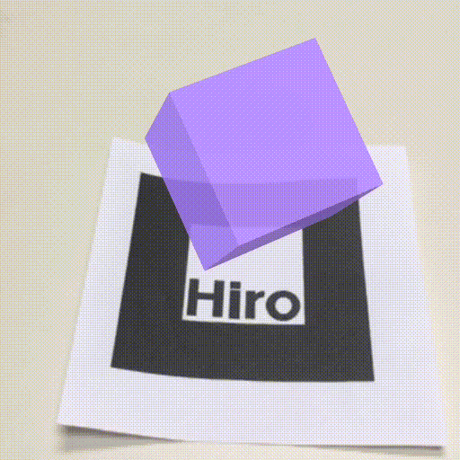

# Welcome to Ambient Lab Immersive Learning

Try it out! Scan the AR-Marker below using a smartphone and allow the webpage to access the camera.

  <p align="center">
  

  </p>


Documentation for an EE296 and EE 496 project focusing on the implementation of an immersive learning solution based on Augmented Reality and QR codes.

Augmented Reality (AR) refers to technology that overlays information or virtual objects on real-world scenes in real-time.  Education is a major field that is currently being affected by AR.  AR can introduce new methods of teaching, change the location and timing of studying, and make the learning process more engaging.  Smartphones are the ideal platform for AR in education due to portability, size, and availability.  Our team is interested in exploring ways to create a more immersive and engaging learning experience using smartphone AR technology.


# Introductory Examples and Setting Up The Environment
The following examples were completed to get accustomed to using AR.js, A-Frame, and the environment.  These examples taught us how to use the special html tags, ordering, and components of each tag.  These examples proved to be useful exercises for team members who were not so familiar with html.

### 1. Basic Cube

  <p align="center">
  
  </p>

A basic example using A-Frame and AR.js to render a red box directly on the Hiro marker.  The box is rendered with the code:

```html
 <a-box position='0 0.5 0' material='opacity: 0.5; side:double; color:red;'> </a-box>
```
where position indicates the x, y, z components of the cube.  The "side: double" variable also tells A-Frame to render more than one face.  This gives the 3-D effect in the cube. 

  *  Webpage: [Basic Cube Example](./aframe/examples/basic.html)
  *  [Source Code](https://github.com/ambientimmersivelearning/ARdemos/blob/master/aframe/examples/basic.html)
  <p align="center">
  
  </p>
  
### 2. Basic Sphere

  <p align="center">
  
  </p>

Another example to render a green sphere slightly away from the Hiro marker. We call the html tag `a-sphere` and changed `position='0 2 0'` so that the sphere hovers 2 units in the y axis above the marker.  If we edit the x or z axis, the sphere will appear off center of the marker.

  *  Webpage: [Basic Sphere Example](./aframe/examples/sphere.html)
  *  [Source Code](https://github.com/ambientimmersivelearning/ARdemos/blob/master/aframe/examples/sphere.html)
   <p align="center">
  
</p>

### 3. Basic Scene

  <p align="center">
  
  </p>

This example sets up a basic scene using multiple objects, a plane, and text.  A cylinder, cone, and octahedron are layered within each other, and hover above a plane.  The text "Hello World!" is shown in front of the these objects.  Each object is rendered using an A-Frame html tag such as `a-cylinder`, `a-cone`, or `a-octahedron`.  The text is rendered using `a-text`.  This example is helpful in moving towards more complicated scenes.

We also see how layered objects interact with one another with different opacity.  The cylinder and cone show graininess at points of intersection.

  *  Webpage: [Basic Scene Example](./aframe/examples/scene.html)
  *  [Source Code](https://github.com/ambientimmersivelearning/ARdemos/blob/master/aframe/examples/scene.html)
   <p align="center">
  
</p>

# Testing Interactivity
These next few examples are building and understanding the limits of interactivity for mobile browser AR.  Our main goals were to explore tapping, scaling, dragging, and animation.

### 1. Tapping (cursor)

  <p align="center">
  
  </p>
  
Our team realized that any object interactivity would require JavaScript scripts to handle mouse events.  We did some research and found that A-Frame has it's own cursor feature that became available in v0.6.1 by setting `<a-scene cursor="rayOrigin: mouse">`.  Unfortunately according to the API there are no `hovering`/`hovered` or `mouseenter`/`mouseexit` states for mobile. This vastly limits how the user can interact with the object on a smartphone.  Our team will have to think more creatively about interactivity when coming up with the larger demo.

In this example we tested a desktop version and a mobile version because of different interactiveness.  A purple box at a 30 degree angle was anchored to the marker.  Using `<a-animation>` we included two different animations when the box is tapped, it will spin and change color.  The `fill` component in animation determines the effect of animation when not actively in plan.  We ran into problems with the color animation but realized we needed to change `fill = backwards` to `fill = forwards` so that after the animation the color would not immediately get set to NULL.

On desktop we fused the cursor to an object, so the animation only happens if the box is dragged to the ring. Clicking on the object will not start the animation.

The following code defines the fused cursor ring. 
```html
    <a-entity camera look-controls>
      <a-entity cursor="fuse: true; fuseTimeout: 500"
                position="0 0 -1"
                geometry="primitive: ring; radiusInner: 0.02; radiusOuter: 0.03"
                material="color: black; shader: flat">
      </a-entity>
    </a-entity>
```
 For mobile, fuse is set to `false`.  The user starts the animation by tapping on the object.
 
 The following code defines the cursor attached to the marker.  Unlike on desktop, `camera look-controls` has been attached to  `<a-scene>` rather than a separate entity.
 
 ```html
<a-anchor hit-testing-enabled='true'
              cursor="fuse: false; fuseTimeout: 500"
              position="0 0 -5"
              geometry="primitive: plane"
              material="visible: false">
```

  *  Webpage: [Desktop Tapping Example](./aframe/examples/tapping.html)
  *  [Source Code](https://github.com/ambientimmersivelearning/ARdemos/blob/aframe/examples/tapping.html)
  
  *  Webpage: [Mobile Tapping Example](./aframe/examples/tappingmobile.html)
  *  [Source Code](https://github.com/ambientimmersivelearning/ARdemos/blob/aframe/examples/tappingmobile.html)
      
   <p align="center">
  
   </p>
   
### 2. Dragging (click-drag)
Our next goal was to implement a smoother dragging interaction.  In the tapping example, the user is briefly able to drag the object, but it's choppy and times out after a couple of movements.  A-Frame does not include API for dragging, but we found a script called aframe-click-drag-component that accomplishes this.  As in the previous example we did two versions: desktop and mobile.

The `click-drag` component is included into the objects tag to run the dragging script.  To avoid cross interactions between clicking and dragging we did not set `cursor` in this example.  The following code shows a sphere with the ability to be dragged.

```html
<a-sphere click-drag
    position='0 0 -5'
    color='lightsalmon'
    dynamic-body='mass: 20'
    radius='0.5'>
</a-sphere>
```

The `dynamic-body` component designates that the sphere is a freely moving object, it has mass and can collide with other objects.  This will be an interesting component to explore when using multiple markers.  A `static-body` will not be affected by gravity or collisions.

There are several glitches that we can't currently fix with the dragging interaction.  On the desktop version it functions properly, but with mobile the dragging is inverted.  We tried to fix it by reversing the mouse drag in the following code.

```html
<a-entity camera look-controls="reverseMouseDrag: true"></a-entity>
```

When testing the mobile version on a desktop browser, this solution works properly, but when actually running on mobile it still fails.  Another issue we found is that dragging on mobile only works horizontally across the screen, not vertically.  However, it is not very problematic because the mobile platform gives dynamism to both the camera and marker.  By just tilting the phone/marker, dragging horizontally can translate into dragging on the x, y, or z axis.

  *  Webpage: [Desktop Dragging Example](./aframe/examples/dragging.html)
  *  [Source Code](https://github.com/ambientimmersivelearning/ARdemos/blob/master/aframe/examples/dragging.html)
  
  *  Webpage: [Mobile Dragging Example](./aframe/examples/draggingmobile.html)
  *  [Source Code](https://github.com/ambientimmersivelearning/ARdemos/blob/master/aframe/examples/draggingmobile.html)
  
     <p align="center">
     
     </p>
     
### 3. Improving Mobile Use (hammer.js)

  <p align="center">
  
  </p>
  

After running through these examples it became clear to our team that relying solely on A-Frame and AR.js API was not going to be sufficient for a smooth mobile experience.  We looked for ways to better handle touch gestures and found hammer.js.  Hammer is an open-source library that can recognize gestures made by touch, mouse, and pointerEvents.

We redid the last two examples using hammer.js as opposed to relying on `cursor` and `click-drag`.  The results were so much better!  Hammer makes it really easy to subscribe to touch events.  We simply added `id = 'model'` to the `<a-box>` component and scripted different touch events for the model id.

The following code shows how we subscribe to the model we need, and set up a hammer manager for the scene.  This manager handles all gestures; the example shows how it handles a `tap` gesture to change color.  In this example we also handled `pinch` to scale the box and `swipe` to rotate.

```javascript
    const model = document.getElementById('model')
    const manager = new Hammer.Manager(scene)
    const tap = new Hammer.Tap({
        taps: 1
    })
    manager.add(tap)
    manager.on('tap', function (ev) { ... })
```

The one downside is that dragging is still not a reliable action on mobile, so our team will have to avoid that from now on.  We are much happier with this implementation of interactivity.

  *  Webpage: [Hammer Gestures Example](./aframe/examples/hammertest.html)
  *  [Source Code](https://github.com/ambientimmersivelearning/ARdemos/blob/master/aframe/examples/hammertest.html)
  
     <p align="center">
     
     </p>