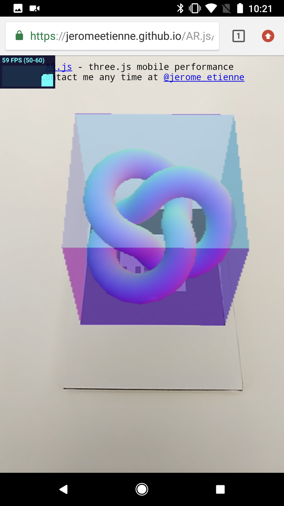

# Welcome to Ambient Lab Immersive Learning

Try it out! Scan the AR-Marker below using a smartphone and allow the webpage to access the camera.

  <p align="center" >
  

  </p>


This is documentation for an EE 296 and EE 496 project focusing on the implementation of an immersive learning solution based on Augmented Reality and QR codes.

Augmented Reality (AR) refers to technology that overlays information or virtual objects on real-world scenes in real-time.  Education is a major field that is currently being affected by AR.  AR can introduce new methods of teaching, change the location and timing of studying, and make the learning process more engaging.  Smartphones are the ideal platform for AR in education due to portability, size, and availability.  Our team is interested in exploring ways to create a more immersive and engaging learning experience using browser based smartphone AR technology.


# Introductory Examples and Setting Up The Environment
The following examples were completed to get accustomed to using AR.js, A-Frame, and the environment.  These examples taught us how to use the special html tags, ordering, and components of each tag.  These examples proved to be useful exercises for team members who were not so familiar with html.

### 1. Basic Cube

  <p align="center">
  
  </p>

A basic example using A-Frame and AR.js to render a red box directly on the Hiro marker.  The box is rendered with the code:

```html
 <a-box position='0 0.5 0' material='opacity: 0.5; side:double; color:red;'> </a-box>
```
where position indicates the x, y, z components of the cube.  The "side: double" variable also tells A-Frame to render more than one face.  This gives the 3-D effect in the cube. 

  *  Webpage: [Basic Cube Example](./aframe/examples/basic.html)
  *  [Source Code](https://github.com/ambientimmersivelearning/ARdemos/blob/master/aframe/examples/basic.html)
  <p align="center">
  
  </p>
  
### 2. Basic Sphere

  <p align="center">
  
  </p>

Another example to render a green sphere slightly away from the Hiro marker. We call the html tag `a-sphere` and changed `position='0 2 0'` so that the sphere hovers 2 units in the y axis above the marker.  If we edit the x or z axis, the sphere will appear off center of the marker.

  *  Webpage: [Basic Sphere Example](./aframe/examples/sphere.html)
  *  [Source Code](https://github.com/ambientimmersivelearning/ARdemos/blob/master/aframe/examples/sphere.html)
   <p align="center">
  
</p>

### 3. Basic Scene

  <p align="center">
  
  </p>

This example sets up a basic scene using multiple objects, a plane, and text.  A cylinder, cone, and octahedron are layered within each other, and hover above a plane.  The text "Hello World!" is shown in front of the these objects.  Each object is rendered using an A-Frame html tag such as `a-cylinder`, `a-cone`, or `a-octahedron`.  The text is rendered using `a-text`.  This example is helpful in moving towards more complicated scenes.

We also see how layered objects interact with one another with different opacity.  The cylinder and cone show graininess at points of intersection.

  *  Webpage: [Basic Scene Example](./aframe/examples/scene.html)
  *  [Source Code](https://github.com/ambientimmersivelearning/ARdemos/blob/master/aframe/examples/scene.html)
   <p align="center">
  
</p>

# Testing Mobile Interactivity
These next few examples are building and understanding the limits of interactivity for mobile browser AR.  Our main goals were to explore tapping, scaling, dragging, and animation.

### 1. Tapping (cursor)

  <p align="center">
  
  </p>
  
Our team realized that any object interactivity would require JavaScript scripts to handle mouse events.  We did some research and found that A-Frame has it's own cursor feature that became available in v0.6.1 by setting `<a-scene cursor="rayOrigin: mouse">`.  Unfortunately according to the API there are no `hovering`/`hovered` or `mouseenter`/`mouseexit` states for mobile. This vastly limits how the user can interact with the object on a smartphone.  Our team will have to think more creatively about interactivity when coming up with the larger demo.

In this example we tested a desktop version and a mobile version because of different interactiveness.  A purple box at a 30 degree angle was anchored to the marker.  Using `<a-animation>` we included two different animations when the box is tapped, it will spin and change color.  The `fill` component in animation determines the effect of animation when not actively in plan.  We ran into problems with the color animation but realized we needed to change `fill = backwards` to `fill = forwards` so that after the animation the color would not immediately get set to NULL.

On desktop we fused the cursor to an object, so the animation only happens if the box is dragged to the ring. Clicking on the object will not start the animation.

The following code defines the fused cursor ring. 
```html
    <a-entity camera look-controls>
      <a-entity cursor="fuse: true; fuseTimeout: 500"
                position="0 0 -1"
                geometry="primitive: ring; radiusInner: 0.02; radiusOuter: 0.03"
                material="color: black; shader: flat">
      </a-entity>
    </a-entity>
```
 For mobile, fuse is set to `false`.  The user starts the animation by tapping on the object.
 
 The following code defines the cursor attached to the marker.  Unlike on desktop, `camera look-controls` has been attached to  `<a-scene>` rather than a separate entity.
 
 ```html
<a-anchor hit-testing-enabled='true'
              cursor="fuse: false; fuseTimeout: 500"
              position="0 0 -5"
              geometry="primitive: plane"
              material="visible: false">
```

  *  Webpage: [Desktop Tapping Example](./aframe/examples/tapping.html)
  *  [Source Code](https://github.com/ambientimmersivelearning/ARdemos/blob/aframe/examples/tapping.html)
  
  *  Webpage: [Mobile Tapping Example](./aframe/examples/tappingmobile.html)
  *  [Source Code](https://github.com/ambientimmersivelearning/ARdemos/blob/aframe/examples/tappingmobile.html)
      
   <p align="center">
  
   </p>
   
### 2. Dragging (click-drag)
Our next goal was to implement a smoother dragging interaction.  In the tapping example, the user is briefly able to drag the object, but it's choppy and times out after a couple of movements.  A-Frame does not include API for dragging, but we found a script called aframe-click-drag-component that accomplishes this.  As in the previous example we did two versions: desktop and mobile.

The `click-drag` component is included into the objects tag to run the dragging script.  To avoid cross interactions between clicking and dragging we did not set `cursor` in this example.  The following code shows a sphere with the ability to be dragged.

```html
<a-sphere click-drag
    position='0 0 -5'
    color='lightsalmon'
    dynamic-body='mass: 20'
    radius='0.5'>
</a-sphere>
```

The `dynamic-body` component designates that the sphere is a freely moving object, it has mass and can collide with other objects.  This will be an interesting component to explore when using multiple markers.  A `static-body` will not be affected by gravity or collisions.

There are several glitches that we can't currently fix with the dragging interaction.  On the desktop version it functions properly, but with mobile the dragging is inverted.  We tried to fix it by reversing the mouse drag in the following code.

```html
<a-entity camera look-controls="reverseMouseDrag: true"></a-entity>
```

When testing the mobile version on a desktop browser, this solution works properly, but when actually running on mobile it still fails.  Another issue we found is that dragging on mobile only works horizontally across the screen, not vertically.  However, it is not very problematic because the mobile platform gives dynamism to both the camera and marker.  By just tilting the phone/marker, dragging horizontally can translate into dragging on the x, y, or z axis.

  *  Webpage: [Desktop Dragging Example](./aframe/examples/dragging.html)
  *  [Source Code](https://github.com/ambientimmersivelearning/ARdemos/blob/master/aframe/examples/dragging.html)
  
  *  Webpage: [Mobile Dragging Example](./aframe/examples/draggingmobile.html)
  *  [Source Code](https://github.com/ambientimmersivelearning/ARdemos/blob/master/aframe/examples/draggingmobile.html)
  
     <p align="center">
     
     </p>
     
### 3. Improving Mobile Use (hammer.js)

  <p align="center">
  
  </p>
  

After running through these examples it became clear to our team that relying solely on A-Frame and AR.js API was not going to be sufficient for a smooth mobile experience.  We looked for ways to better handle touch gestures and found hammer.js.  Hammer is an open-source library that can recognize gestures made by touch, mouse, and pointerEvents.

We redid the last two examples using hammer.js as opposed to relying on `cursor` and `click-drag`.  The results were so much better!  Hammer makes it really easy to subscribe to touch events.  We simply added `id = 'model'` to the `<a-box>` component and scripted different touch events for the model id.

The following code shows how we subscribe to the model we need, and set up a hammer manager for the scene.  This manager handles all gestures; the example shows how it handles a `tap` gesture to change color.  In this example we also handled `pinch` to scale the box and `swipe` to rotate.

```javascript
    const model = document.getElementById('model')
    const manager = new Hammer.Manager(scene)
    const tap = new Hammer.Tap({
        taps: 1
    })
    manager.add(tap)
    manager.on('tap', function (ev) { ... })
```

The one downside is that dragging is still not a reliable action on mobile, so our team will have to avoid that from now on.  We are much happier with this implementation of interactivity.

  *  Webpage: [Hammer Gestures Example](./aframe/examples/hammertest.html)
  *  [Source Code](https://github.com/ambientimmersivelearning/ARdemos/blob/master/aframe/examples/hammertest.html)
  
     <p align="center">
     
     </p>
     

### 4. Testing Mobile Performance
During our research we found a program created by Jermone Etienne, the creator of AR.js, that allows users to test mobile performance.  Using three.js, the program has a small FPS counter in the top right corner of the webpage.  We tested different phones by waving Hiro markers in the scene and observing for frame drops.

According to Etienne, mobile performs incredibly well and has up to 60 FPS on 2 year old devices.  The images below show screenshots of the mobile performance testing on an iPhone 5 SE (left) and Google Pixel 2 (right).

 <p align="center">
     
     
 </p>
     
The iPhone 5 SE, which was released in 2016, has a range of 38-60 FPS, but generally performed from 54 above.  The Pixel 2, released in 2017, has an FPS range of 50-60, but also averaged 57 and above.  If we were to test more recent phones we believe the performance would be even better and more stable.  However, during all the demonstrations we've created so far the iPhone has no problem keeping up.

The AR.js documentation states:

> We are still early in the project but here are some initial numbers to give you an idea.

> * I got 60fps stable on Nexus6P

> * I got 60fps stable on nexus6p
> * Some reports [Sony Xperia Z2 (2.5 years old) runs around 50fps](https://twitter.com/leinadkalpot/status/834121238087925763) - this is a 170euro phone
> * Some reports [~50fps on a old nexus5, and ~60fps on nexus 9](https://twitter.com/Ellyll/status/834312442926751744) - nexus5 is 3.5 years old!
> * Some reports it working on windows phone edge!! [13fps on Lumia 950](https://twitter.com/leinadkalpot/status/834299384510763012) for some.
  [40-45fps on lumia 930](https://twitter.com/fastclemmy/status/834817155665391616) for others.

> Obviously you mileage may vary. The performance you get will depend on 3 things: How heavy your 3D is, How you tune your parameters
and the hardware that you are using.

If you're more interested in this mobile performance testing or want to try it out yourself you can click on the links below.

  *  Webpage: [Mobile Performance Testing](https://jeromeetienne.github.io/AR.js/three.js/examples/mobile-performance.html)
  *  [Source Code](https://github.com/jeromeetienne/AR.js/blob/master/aframe/examples/mobile-performance.html)
  

# Implementing Multiple Markers
The next steps in our design were to implement multiple markers in one browser page.  This ended up being more difficult than expected.

### 1. Creating and Training Custom Markers
Having the Hiro marker is great, but when expanding scenarios to multiple markers we need a bunch of them.  However, coming up with markers was much trickier than originally expected and difficult to test.

There are several types of markers that can be used such as pattern and barcode.  Hiro is considered a pattern marker, so we made more of these types. There are many limitations on size and shape.  After doing some research we learned:
  * They must be square
  * No white/transparent areas, only light gray
  * Must be simple, but not too simple
 
The first round of markers failed miserably because they were too detailed.  Markers are transformed in .patt files and are encoded in grayscale.  The following images show a marker that failed and it's corresponding encoding.
 
  <p align="center">
   
      
   </p>
   
We created a second round of markers and trained them.  This batch was based on simple icons and turned out far better.  We made sure to have large amount of black in simple patterns.  The following images show a successful marker.  You can see the encoding is much more recognizable, even to the human eye.

  <p align="center">
   
      
   </p>
 
 The ten custom markers we created along with their pattern files can be viewed [here](https://github.com/ambientimmersivelearning/ARdemos/tree/master/markers).
 
### 2. Implementing Multi-Marker Example

  <p align="center">
  
  </p>

 Our next goal was to get all 10 markers working in one demonstration.  We decided to have each marker show a different colored box.  Programming it was relatively straightforward, each marker is declared in the scene and a link to the .patt file is included.
 
 ```html
    <a-marker preset="custom" type="pattern" url="https://raw.githubusercontent.com/ambientimmersivelearning/ARdemos/master/markers/bow.patt">
       <!-- Add your augmented reality here -->
       <a-box position='0 0 0' material='opacity: 1; side:double; color:red;'>
       </a-box>
    </a-marker>
```
 
When implementing this example we ran into a problem where the program would not properly load the .patt file if we included the file from the directory.  Switching to loading it from the raw GitHub source fixed it.
 
When running multiple markers we expected the shapes to distort easily and for the AR.js tracking to not handle them sufficiently.  However, we were surprised that performance did not decrease at all with ten markers in the same scene.

  *  Webpage: [Multiple Markers Example](./aframe/examples/multiplemarkers.html)
  *  [Source Code](https://github.com/ambientimmersivelearning/ARdemos/blob/master/aframe/examples/multiplemarkers.html)
  
     <p align="center">
     
     </p>
     
### 3. Measuring Distance Between Markers


After getting multiple markers working together we wanted to have them interact with one another.  Lucky for us there was a very helpful [example](https://github.com/jeromeetienne/AR.js/blob/master/three.js/examples/measure-it.html) online.  This example sets up the basis for measuring the distance between two markers.  We tweaked the example by customizing it with our own markers using Bow and Check.  A lot of time was spent reading through this code and trying to understand it.  The example used the three.js library, which we were not heavily exposed to in previous demos.

This example definitely gave us ideas for expanding interactivity between markers, but we also realized there were a couple of drawbacks.  While it would be really cool to be able to measure the distance and create separate events for 10 custom markers, the code would be tedious and messy.  The following is just setting up characteristics for one marker:

```javascript
        // build markerControls
        var markerRoot1 = new THREE.Group
        markerRoot1.name = 'marker1'
        scene.add(markerRoot1)
        var markerControls = new THREEx.ArMarkerControls(arToolkitContext, markerRoot1, {
            type : 'pattern',
            patternUrl : 'https://raw.githubusercontent.com/ambientimmersivelearning/ARdemos/master/markers/bow.patt',
            // patternUrl : THREEx.ArToolkitContext.baseURL + '../data/data/patt.kanji',
        })
        // add a gizmo in the center of the marker
        var geometry	= new THREE.OctahedronGeometry( 0.1, 0 )
        var material	= new THREE.MeshNormalMaterial({
            wireframe: true
        });
        var mesh	= new THREE.Mesh( geometry, material );
        markerRoot1.add( mesh );
```

We need to repeat the code above for a second marker as well.  If we tried using all ten custom markers, with custom shapes it would get out of hand very quickly.  Next, we need to have the two markers interact using a line and showing the distance between them:

```javascript
onRenderFcts.push(function(){
            var geometry = lineMesh.geometry
            geometry.vertices[0].copy(markerRoot1.position)
            geometry.vertices[1].copy(markerRoot2.position)
            geometry.verticesNeedUpdate = true
            geometry.computeBoundingSphere();
            geometry.computeLineDistances();

            var length = markerRoot1.position.distanceTo(markerRoot2.position)
            lineMesh.material.scale = length * 10
            lineMesh.material.needsUpdate = true
        })
```

To put it into perspective if we used three markers in this example we'd be measuring positions between Marker1-Marker2, Marker2-Marker3, and Marker1-Marker3.  The combinations available are n choose 2 (shoutout to EE 342).  If we have four markers, there are six combinations; ten markers equals 45 combinations to keep track of.

  *  Webpage: [Measuring Example](./three.js/examples/measure-it.html)
  *  [Source Code](https://github.com/ambientimmersivelearning/ARdemos/blob/master/three.js/examples/measure-it.html)
  
       <p align="center">
       
       </p>
       
### 4. Chemistry Demonstration (WIP)
As the semester was winding down we tried to implement a chemistry demonstration.  Our idea was to have different atoms tied to custom markers and when they were in close range of one another they could combine into new molecules.  We had a function checking for a distance < 2 between two markers and then the marker would update.  However, the rendering is not working properly.  Our rendering function is below:

```javascript
onRenderFcts.push(function(){
            var length = markerRoot1.position.distanceTo(markerRoot2.position)

            if(length < 2){
                var newcolor = new THREE.Color("rgb(0,102,255)");
                markerRoot1.material.color = newcolor;
                markerRoot1.material.color.needsUpdate = true;
            }
        })
``` 

The program freezes when the markers are within 2 units of one another, so we know the length is registering.  However, when we were testing a simple color change the material does not update.

  *  Webpage: [Chemistry Example](./three.js/examples/chemistry.html)
  *  [Source Code](https://github.com/ambientimmersivelearning/ARdemos/blob/master/three.js/examples/chemistry.html)
  
  
# Conclusion
This has been a really enjoyable project to work on.  There were basic components that made it perfect for an EE 296 project, and more complicated problems that made it EE 496 appropriate. AR-Codes are a viable, cheap, and efficient way to deliver AR to the classroom— without requiring excessive equipment, proprietary software, or extensive knowledge of technology on the part of the teacher. Many of the available Mixed Reality frameworks are inaccessible to programming laymen/educators interested in developing simple, customized classroom activities. A-Frame and AR.js combat this by using basic HTML with minimal setup. With additional time and development this platform could be at the forefront of bringing AR into the classroom, adding it to textbooks, or including models on assignments.  We have high hopes!
